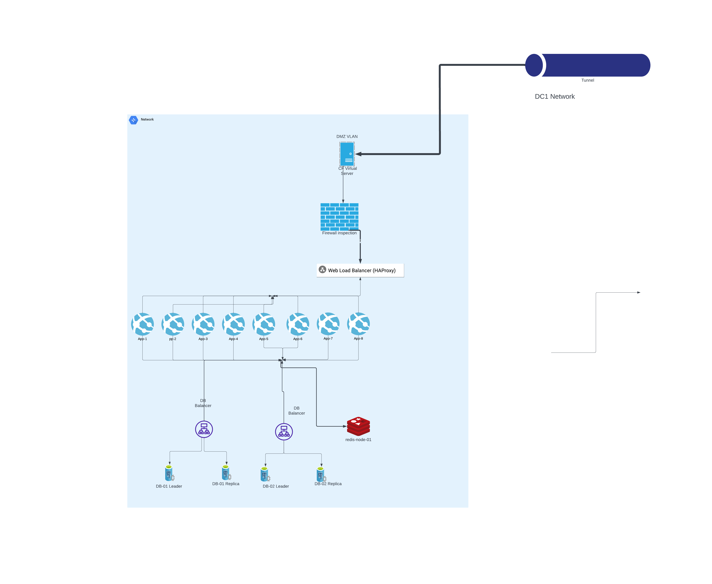

# Inside the internal network

Here is an overview of a simplified version of the inside of each Data Center:

We have a Load Balancer distributing traffic between multiple web servers (app servers). We use HAProxy to achieve this functionality. Behind these web application servers are many other resources that we use, such as multiple Database Clusters, Redis, background job runners, and many cloud-based services such as Amazon S3, Amazon SES, and various Google Web services. So, as mentioned before, we still rely on some cloud functionalities.

Please note that database replication occurs over a Site-to-Site VPN between the firewalls connecting these two networks together.

Next, we will cover the complex topic of High Availability (HA) for Databases. We love PostgreSQL and use the [following](https://autobase.tech/) project to create and maintain clusters of databases with replication across Data Centers. We will get to this broad topic later. Let's jump to another world which is hypervisors and talking to your hypervisor using automation tools such a Terraform.
