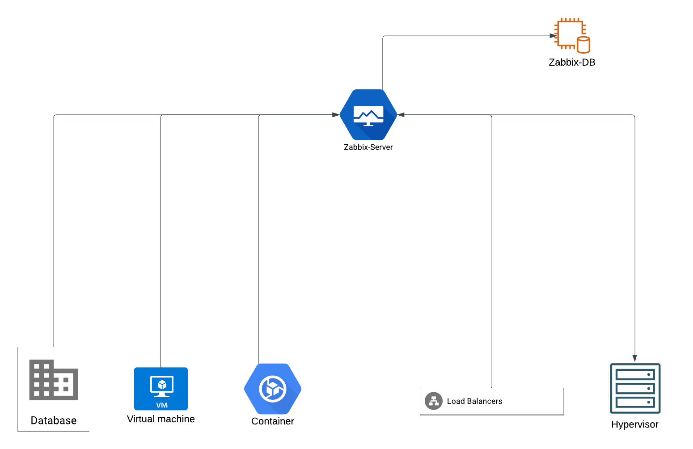

# Monitoring
Similar to our use of AWS, we relied on the paid monitoring services from DataDog. Undoubtedly, DataDog provides detailed insights into both network and application performance. However, as our customer base continued to grow, we found ourselves needing additional resources to keep up with increasing demand. In turn, this expansion drove our monitoring costs higher. We decided to adopt an open-source alternative, [Zabbix](https://www.zabbix.com/), to meet our expanding monitoring needs. Leveraging this solution, our team achieved a robust infrastructure that includes:

**NMS (Network Monitoring System)**: Focuses on the health and performance of networks, servers, and key application/service metrics.

**APM (Application Performance Monitoring)**: Provides application-level insights. For our web-based services, this includes monitoring worker load, HTTP errors, average response times, and other critical metrics.

## Monitoring Deployment
One might wonder about the approach we followed to automate the monitoring installation, including the setup of the Zabbix server, database installation, and configurations. Our process also covers adding every node in the infrastructure and enabling the desired monitoring for each section, tailored to the specific requirements of different servers.

As evident from our automation [section](/journeys/edclub/infrastructure/automation), we promote streamlining tasks through automation. We have designed the entire process to be executed from a single command/ansible-playbook, which seamlessly provisions and configures the entire cluster. Here is an example of the cluster:

