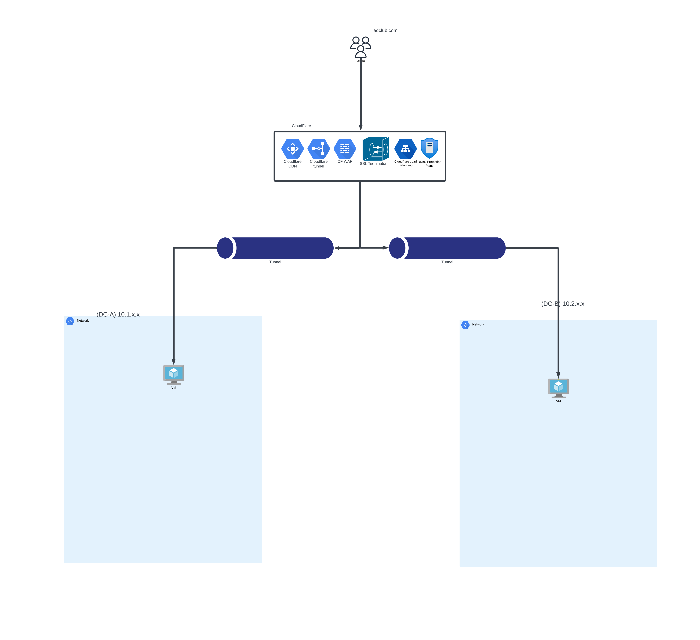

# Traffic Flow

Here is an overview of the visitors' traffic being served:

Requests are routed to the CloudFlare network using the DNS proxy feature of CloudFlare (CF) and go through multiple layers of CF functionality before being routed to a tunnel endpoint. Some of those layers are CF DDoS protection, URL Rewrite, Page Rules, etc. [Here](../../../assets/images/Cloudflare-traffic%20sequence.png) is a graph listing the layers. Once the traffic has gone through all those rules and layers, it will need to be routed to a Cloudflare tunnel that has been created using the Cloudflared daemon that is installed and authenticated on a VM or an LXC on your hypervisor. Using these tunnels prevents us from opening any ports on our Firewall, which helps increase our security posture.

As you can see in the image above, the traffic can be balanced between two Data Centers, and once it reaches the other side of the network, it can be sent to a Load Balancer (after going through the Firewall (optional step)) for further packet inspection and routing.

